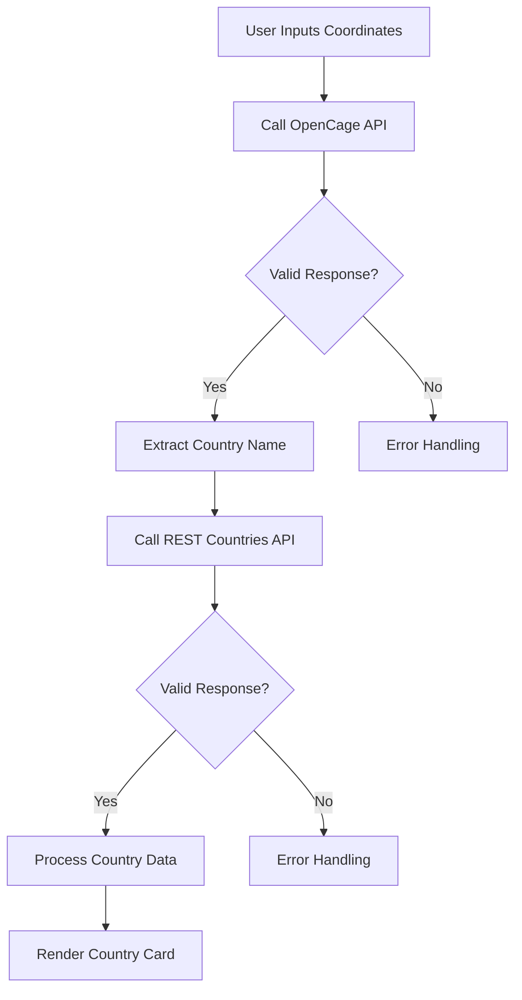

<h1 align="center">🌍 Reverse<span style="color:#00bcd4">GeoCode</span> – Coordinate-Based Country Explorer</h1> <p align="center">  </p> <p align="center"> A sleek web application that transforms coordinates into rich country information. Modern async JS. Error handling. API integration. </p>
📋 Overview

ReverseGeoCode is an interactive web application that lets users discover detailed information about countries based on geographical coordinates. This project was developed primarily as a learning exercise for:

     Asynchronous JavaScript
     Error Handling
     Working with External APIs

⚙️ Core Functionality

The application takes geographical coordinates (latitude and longitude) and:

    Converts coordinates to a country name using the OpenCage Geocoding API
    Fetches detailed country information from the REST Countries API
    Renders a beautiful card with key information about the country
    Lets users auto-detect their location via the browser’s Geolocation API if they don’t want to manually enter coordinates

🌠 Preview
<p align="center">  </p>
C:\Users\mianq\Web-Projects\ReverseGeoCoding\src\
##  Learning Objectives Achieved

### 1. Asynchronous JavaScript
```javascript
// Example of async/await pattern used in the project
const fetchCountryInfo = async function(lat, lng) {
    try {
        let country = await myCountry(lat, lng);
        const res = await fetch(`https://restcountries.com/v3.1/name/${country}`);
        // Processing continues after promises resolve
        const [data] = await res.json();
        renderCountryCard(data);
    } catch(err) {
        // Error handling
        alert(err.message);
    }
}
```

### 2. Error Handling
```javascript
try {
    const res = await fetch(`https://api.opencagedata.com/geocode/v1/json?q=${lat}%2C+${lng}&key=${apiKey}`);
    
    if(!res.ok) {
        throw new Error("Too much request, try after sometime!!");
    }
    
    const data = await res.json();
    // Process data...
} catch(err) {
    alert(err.message);
}
```

### 3. Working with External APIs

| API | Purpose | Implementation |
|-----|---------|---------------|
|  **OpenCage Geocoding API** | Converting coordinates to location data | Reverse geocoding to get country name |
|  **REST Countries API** | Fetching detailed country information | Getting flags, population, languages, etc. |

##  API Workflow

 Resources Used

    JavaScript Async/Await Documentation
    Fetch API Guide
    REST Countries API Documentation
    OpenCage Geocoding API Documentation

<p align="center"> Made with ❤️ Qasim Ali </p> <p align="center"> <a href="https://github.com/yourusername">  </a> </p>
